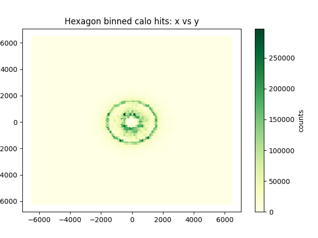
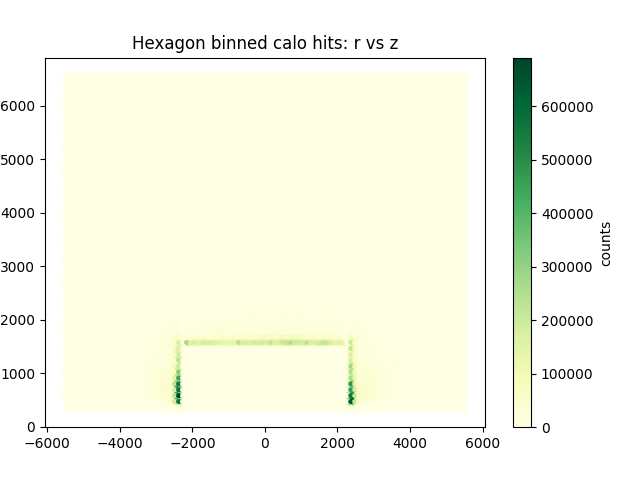

# MuColCalHits

This package is for accessing muon collider simulation GEANT4 hits root file which is prepared by using lcio to edm4hep root file. Some simple python to make evevent dump and plots is also provided.

## Work environment:

The machines available to work in the `hep.wisc.edu` cluster are:

`login01, login02, login03` (EL7) - generically login.hep.wisc.edu with WAN access.

`login04` (AlmaLinux8) - accessible from WAN.

To login to `hep.wisc.edu` cluster, use:

```
ssh -t -Y <your_hep.wisc.edu_user_name>@login04.hep.wisc.edu
```

A better machine to use is the `cms01` (AlmaLinux8) - However, it requires setup of Wisc VPN **or** indirection through above machines. You will be prompted for password twice unless you have setup appropriate .ssh configuration.

```
ssh -t -Y <your_hep.wisc.edu_user_name>@login04.hep.wisc.edu ssh -Y cms01
```

Another option is to use `mucol01` (Almalinux9) - which also requires setup of Wisc VPN **or** indirection through above machines. You will be prompted for password twice unless you have setup appropriate .ssh configuration.

```
ssh -t -Y <your_hep.wisc.edu_user_name>@login04.hep.wisc.edu ssh -Y mucol01
```

To get this repository to your area, either on personal machine or one of the above, use:

```
git clone git@github.com:SridharaDasu/MuColCalHits.git
cd MuColCalHits
```

To get the big H->b,b data to your machine, 

* if on `cms01` or `mucol01`, do:

```
ln -s /nfs_scratch/dasu/MuonCollider/mucoll-benchmarks/edm4hep/mumi_000_edm4hep.root .
ln -s /nfs_scratch/dasu/MuonCollider/mucoll-benchmarks/edm4hep/mumu_H_bb_3TeV_sim_edm4hep.root .
```

* in case you are running on personal machine, noting you need lots of space on your disk, you can use:

```
scp <your_hep.wisc.edu_user_name>@login04.hep.wisc.edu:/nfs_scratch/dasu/MuonCollider/mucoll-benchmarks/edm4hep/mumi_000_edm4hep.root .
scp <your_hep.wisc.edu_user_name>@login04.hep.wisc.edu:/nfs_scratch/dasu/MuonCollider/mucoll-benchmarks/edm4hep/mumu_H_bb_3TeV_sim_edm4hep.root .
```

If working on `hep.wisc.edu` machines `python3, upwork, numpy, matplotlib` should be available on `cms01` and `mucol01`.

If working on your own local machine, I recommend making a `virtualenv` and installing required packages in that `venv`:

```
virtualenv venv
source venv/bin/activate
pip install -r requirements.txt
```
To look at the contents of the files do:

```
python inspector.py mumi_000_edm4hep.root
python inspector.py mumu_H_bb_3TeV_sim_edm4hep.root
```

Both files should have the same information as both are files created by the muon collider detector GEANT4 simulation step.

The mumi_000 file has a fraction of beam induced background from negative muons.

The mumu_H_bb_3TeV file has Higgs to b-quark pair signal events.

Couple of simple plots to make are the XY and RZ hit plots - you can make them using:

```
python plot_xy.py mumi_000_edm4hep.root
python plot_xy.py mumu_H_bb_3TeV_sim_edm4hep.root
python plot_rz.py mumi_000_edm4hep.root
python plot_rz.py mumu_H_bb_3TeV_sim_edm4hep.root
```
Here is how they should look for the Hbb file:





## Wisc VPN

https://kb.wisc.edu/page.php?id=90370
